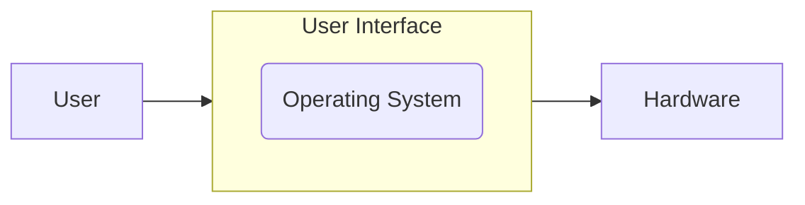
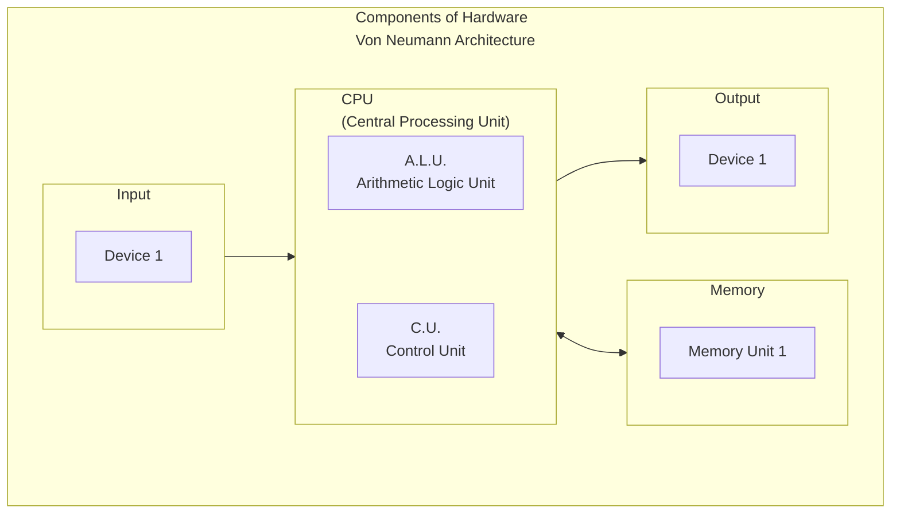

# Ch. 1: What Operating Systems Are

One definition:
> An OS is an *interface* between a person and computer (or "user" and "hardware")



What are interfaces then?



The Control Unit "CU" handles timing and control signals, which further control computer operations. The CU also handles sequencing and execution of micro-operations "micro-ops". Micro-ops are computer instructions that are carried out on data stored in registers. This particular architecture of a computer was proposed by John von Neumann. [Von Neumann Architecture Wikipedia page](https://en.wikipedia.org/wiki/Von_Neumann_architecture)

```c
// an example c program 'example01.c'
int main(void) {
    // 
    int sum = 2 + 3;

    printf("%d\n", sum); // print out sum to the terminal
    return 0;
}
```

C code is a "high level language" which uses "high level statements" (each line in the code above is a high level statement or "macro operation"). In other words, these lines of code are more human readable, and require translation by the computer for it to be able to understand what it is being asked to do.

```arm
; an unoptimized translation of 'example01.c' into LCC Assembly
    mov r0, 2 ; put 1 into register 0 'r0'
    mov r1, 3 ; put 2 into r1
    add r2, r0, r1 ; add r0 and r1 and save result into r2
    st r2, sum ; save r2 into a
    ld r0, sum ; load sum into r0
    dout r0 ; print out the decimal (base 10) number in r0
    nl ; print new line
    halt ; end the program

sum: .word 0
```

Assembly code is a "low level language" which uses "low level instructions" (or "micro operations") which are directly converted into machine code. Assembly is cool because it gives you maximum control over how your programs work, but it can also be a pain because it's really easy to make mistakes, and it's usually harder to read/modify quickly/easily.

```arm
; a simpler program that simply puts 2 numbers into 2 registers
; adds them up, and prints them out
   mov r0, 3
   mov r1, 2
   add r0, r0, r1
   dout r0
   nl
   halt
```


So, what is the ALU? It is also called a "functional unit", which carries out arithmetic and logical operations. The ALU is made up of adders, subtractors, etc.. What are adders and subtractors? They are circuits that special in adding and subtracting.

## Memory

There are two types of memory: primary/main and secondary/auxiliary

Primray memory tends to be smaller in size, faster, more expensive to use, and usually* volatile (data is lost when power is turned off). Examples include RAM, ROM*, cache, and registers

Secondary memory is typically larger in size, slower, cheaper to use, and non-volitile (data is retained when power is turned off). Examples include hard disks and flash drives.

Note: The CPU works directly only with primary memory.

> Q: If the CPU works directly only with primary memory, then where in Von Neumann Architecture is the secondary memory?

> A: Secondary memory, in Von Neumann Architecture, is part of the Input/Output Devices.

---
